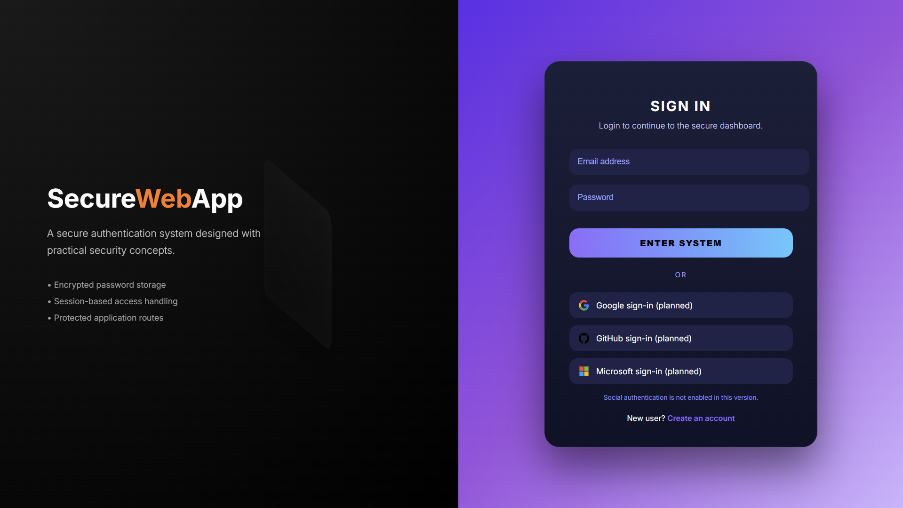
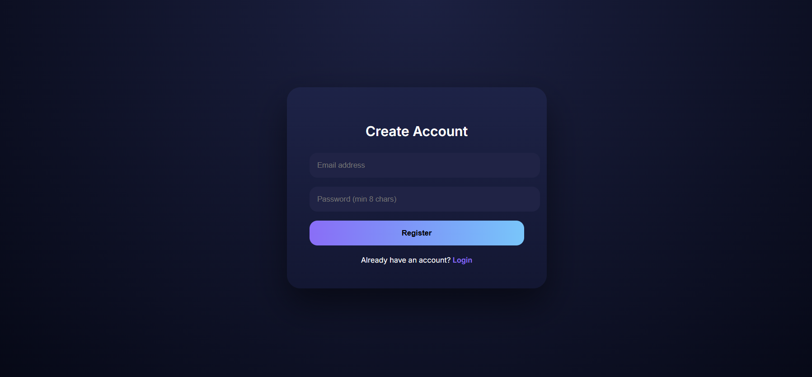
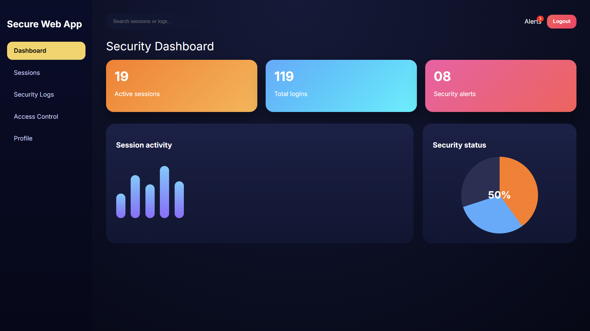
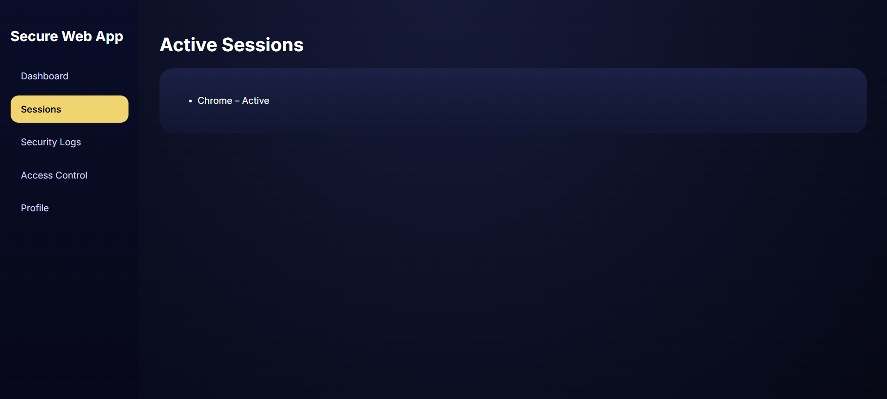
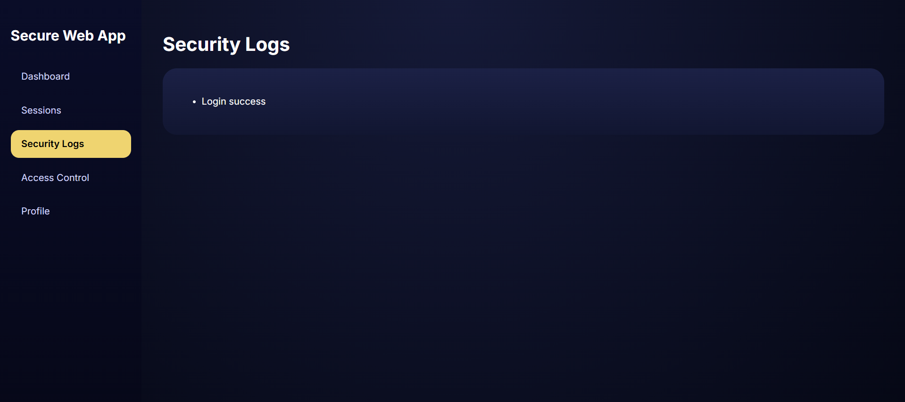
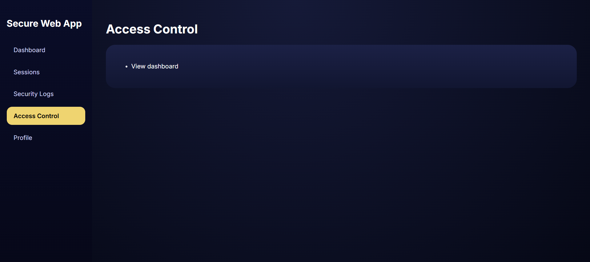
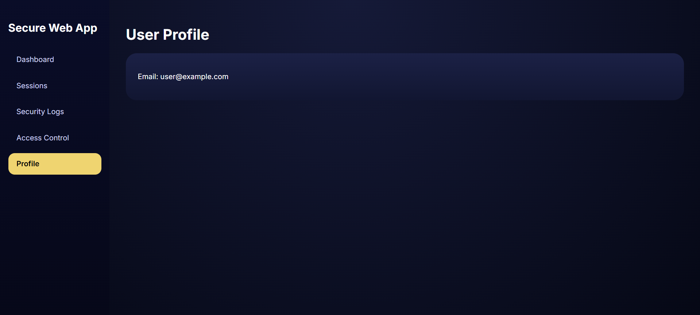

*Secure Web Application & Threat Hardening*

##  Project Overview:
-This project is a secure web application built using Flask that demonstrates core concepts of authentication, authorization, session handling, and basic threat hardening.
-The goal is to understand how real-world web applications protect user data and restrict access to protected resources.

----------------------------------------------------------------------------------------------------------------------------------

## Objectives:
-Implement secure user authentication
-Enforce session-based access control
-Protect sensitive routes from unauthorized access
-Apply password hashing and input validation
-Demonstrate logout and session termination

----------------------------------------------------------------------------------------------------------------------------------
## Core Security Features=

### Authentication & Authorization
- User registration and login system
- Secure password hashing using Werkzeug
- Session-based authentication
- Protected dashboard route (unauthenticated users are redirected)

### Password & Hashing Policies
- Passwords are never stored in plain text
- Passwords are hashed using `generate_password_hash`
- Password verification uses `check_password_hash`
- Minimum password length enforced

### Input Validation & Sanitization
- Email format validation using regex
- Server-side validation for login and registration
- Duplicate email registration prevention

### Session Handling & Access Control
- Flask sessions used to maintain login state
- Unauthorized access to dashboard is blocked
- Secure logout clears all session data

----------------------------------------------------------------------------------------------------------------------------------

## Application Pages:

1]Login Page – User authentication

2]Register Page – New user registration

3]Dashboard – Protected content

4]Sessions – Active session view

5]Security Logs – Login activity

6]Access Control – Permissions overview

7]Profile – User information

8]Logout – Session termination

----------------------------------------------------------------------------------------------------------------------------------

## Technology Stack
- *Backend:* Flask (Python)
- *Frontend:* HTML, CSS
- *Database:* SQLite
- *Security Libraries:* Werkzeug (password hashing)
- *Session Management:* Flask session

----------------------------------------------------------------------------------------------------------------------------------

## Project Structure

GUARDWEB/
│
├── app.py
├── database.db
├── requirements.txt
├── README.md
│
└── templates/
├── login.html
├── register.html
└── dashboard.html

----------------------------------------------------------------------------------------------------------------------------------

##  How to Run the Project

 1] Install dependencies:
Open the VS Code terminal and run in project folder (GUARDWEB):
pip install flask werkzeug

2️] Run the application:
python app.py

3️] Open in browser
http://127.0.0.1:5000

----------------------------------------------------------------------------------------------------------------------------------

## Application Flow:

1]User registers with email and password.

2]Password is securely hashed and stored.

3]User logs in with valid credentials.

4]Session is created on successful login.

5]User is redirected to protected dashboard.

6]Logout clears session and redirects to login page.

----------------------------------------------------------------------------------------------------------------------------------

## Screenshots:

1]Login Page

2]Register Page

3] Dashboard

4] Sessions

5] Security Logs

6] Access Control

7] Profile

----------------------------------------------------------------------------------------------------------------------------------

## Security Highlights:

-Password hashing using industry-standard methods
-Session-based access protection
-Secure logout implementation
-No sensitive data exposed on client side

----------------------------------------------------------------------------------------------------------------------------------

 ## Deliverables:

-Complete source code (GitHub)
-Secure authentication flow
-Session handling & access control
-README with setup instructions
-UI screenshots

----------------------------------------------------------------------------------------------------------------------------------

## Learning Outcome:
-This project demonstrates how security-first design is applied in real web applications, focusing not only on functionality but also on protecting user data and application routes.

----------------------------------------------------------------------------------------------------------------------------------

## Future Improvements:
- CSRF protection
- Rate limiting for login attempts
- Role-based access control (RBAC)
- HTTPS enforcement

### AUTHOR ###
NAME: *PAYAL RATHORE*
Security Fundamentals – Project 01
